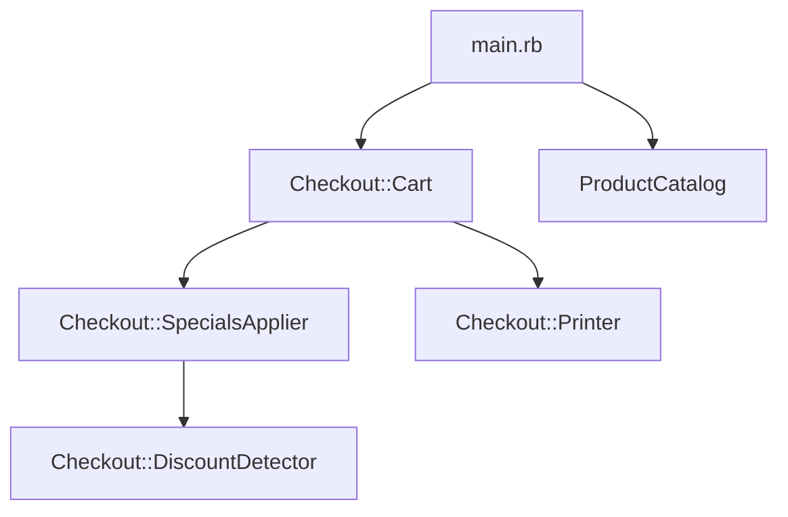

## Project Setup
```sh
git clone https://github.com/efrence/checkout.git
cd checkout
bundle install
```

## Run tests

```sh
rake test
Run options: --seed 19722

# Running:

...........

Finished in 0.001714s, 6417.7363 runs/s, 12252.0420 assertions/s.

11 runs, 21 assertions, 0 failures, 0 errors, 0 skips
```

## Dependencies

Arrow indicates what the file depends on.


